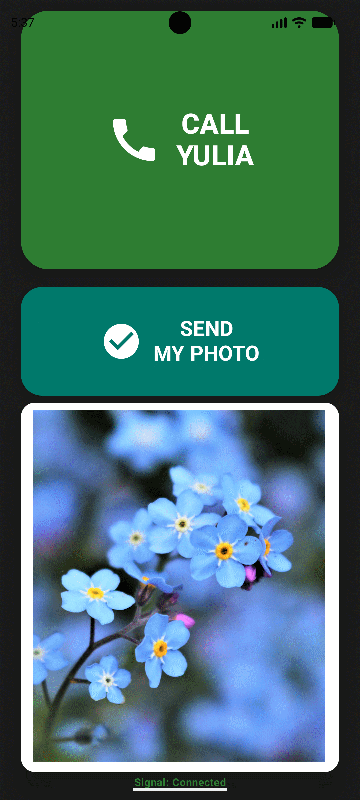

# KindredCall: A Personal Solution for Elderly Connection

Commercial communication apps (WhatsApp, FaceTime, Telegram) are built for digital natives. For my grandmother, menus, contact lists, and scrolling chat feeds were insurmountable technical barriers. When I couldn't find an app that was truly "zero-navigation," I decided to take matters into my own hands and build **KindredCall** from scratch.

KindredCall is a full-stack project (Android + Node.js) designed with one goal: making it as easy as humanly possible for an elderly person to video call and share life moments with their family, even in restrictive network environments.

## 🧠 The Philosophy: "Zero-Navigation"

The "Grandma" side of the app has exactly **zero** menus. No tabs, no settings, no contact lists.
- **One Screen**: The main interface is the only interface.
- **One Purpose**: Large, high-visibility buttons for the two core actions: Calling and Sharing.
- **High Visibility**: Massive typography (80sp+) and high-contrast colors ensure accessibility for users with vision impairments.

## ✨ Core Features

### 1. Bulletproof Full-Screen Calling
Traditional notifications are easy to miss or accidentally swipe away. KindredCall uses "Full Screen Intents" and specialized logic to ensure that when a call comes in, it **takes over the screen immediately**, regardless of whether the phone is locked or unlocked. 

- **Focus Hijack**: Developed a "Immediate Cancellation" logic where the system notification is programmatically killed the millisecond the Activity launches, preventing annoying Heads-Up banners from overlapping the call UI.
- **OEM-Bypass**: Specialized logic for Xiaomi/Redmi devices to handle their unique background-start restrictions.

### 2. The "Latest-Only" Photo Frame
Unlike chat apps that bury photos in a feed, KindredCall features a persistent live photo frame.
- **Simplicity**: It only displays the **one most recent photo** shared by the other person.
- **Automatic Sync**: When a new photo is uploaded, the frame updates in real-time via WebRTC signaling—no manual refreshing required.

### 3. One-Tap Share
Sharing a photo can be intimidating. I implemented a "One-Tap" feature for Grandma: she taps one big button, and the app automatically finds the **most recent photo from her camera reel** and sends it to her relative instantly.

### 4. Network Resilience (DPI Bypass)
This app was built to work in restricted networks where standard VOIP protocols are often throttled or blocked by Deep Packet Inspection (DPI). By using a custom Node.js signaling server and a dedicated TURN server over TCP (Port 443), KindredCall maintains stable connections where mainstream apps struggle.

## 🛠️ Technical Deep Dive

### Android (Kotlin / Jetpack Compose)
- **WebRTC**: Peer-to-peer video/audio engine.
- **Signaling**: Custom WebSocket client for handshakes and real-time gallery triggers.
- **Modern Stack**: 100% Jetpack Compose, Kotlin Coroutines, and Flows.

### Backend (Node.js)
- **Signaling Server**: Orchestrates WebRTC connections.
- **Gallery API**: A minimalist REST API for handling multipart image uploads and serving the "latest" image.
- **Infrastructure**: Hosted on Oracle Cloud VPS, managed by PM2 for "set-it-and-forget-it" uptime.

## 🤖 Built with AI Collaboration
This project was developed using **Android Studio with AI-assisted orchestration**. I focused on the UX architecture, OEM-specific bug hunting, and network strategy, while leveraging AI to rapidly iterate on lower-level protocols and localization.

---
*Developed as a labor of love to keep my family connected.*
